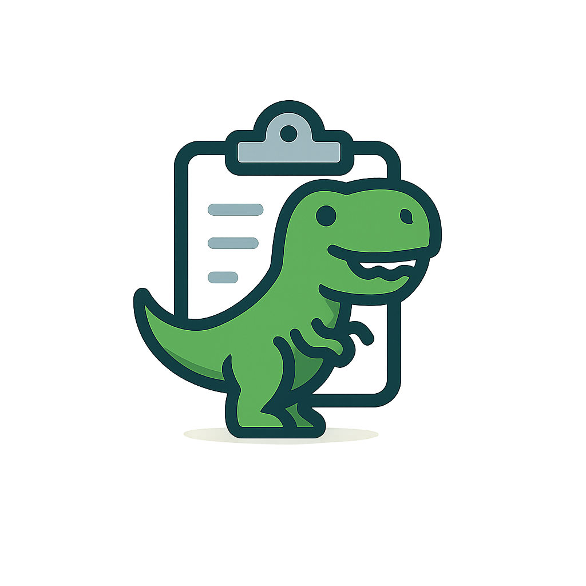

# Trex - Advanced Clipboard Manager

A modern, feature-rich clipboard manager for macOS built with Electron, React, and TypeScript. Trex enhances your productivity by maintaining a searchable history of your clipboard items with intelligent features and seamless user experience.



## ✨ Features

### Core Functionality
- 📋 **Smart Clipboard History** - Configurable history size (minimum 5 items) with text and image support
- 🔍 **Powerful Search** - Instantly search through clipboard history with real-time filtering
- 🖼️ **Image Support** - Copy, preview, and manage images with thumbnails and size information
- ⚙️ **Preferences System** - Customizable settings for history size, notifications, and behavior
- 🔒 **Password Detection** - Automatically excludes passwords from history for security

### User Experience
- ⌨️ **Global Shortcuts** - Quick access with ⌘+Shift+V hotkey
- 🎨 **Beautiful UI** - Modern glass-effect design with smooth animations
- 📱 **Responsive Design** - Optimized interface that adapts to content
- 🌙 **System Integration** - Native macOS tray icon and menu integration
- ⚡ **Fast Performance** - Instant search and smooth interactions

### Advanced Features
- 🔄 **Auto-Updates** - Seamless background updates via GitHub releases
- 🛡️ **Security First** - Context isolation, secure IPC, password exclusion
- 💾 **Persistent Storage** - Settings and history saved between sessions
- 🔔 **Smart Notifications** - Configurable system notifications
- 🎯 **Keyboard Navigation** - Full keyboard control for power users

## 🚀 Quick Start

### Installation
1. Download the latest `Trex-x.x.x.dmg` from [Releases](https://github.com/deanstavenuiter/clipboard-manager/releases)
2. Open the DMG file and drag Trex to Applications
3. Launch Trex from Applications or Spotlight
4. Use ⌘+Shift+V to access your clipboard history

### First Launch
- Trex runs in the background (tray-only app)
- Click the Trex icon in the menu bar for options
- Use ⌘+Shift+V to open the clipboard window
- Start copying items to build your history

## 📖 User Guide

### Keyboard Shortcuts
- **⌘+Shift+V** - Toggle clipboard window
- **1-9** - Quick access to clipboard items (first 9)
- **↑/↓** - Navigate through items
- **Enter** - Copy selected item to clipboard
- **⌫/Delete** - Delete selected item
- **Escape** - Close window
- **/** - Focus search input

### Search Functionality
- Type in the search box to filter clipboard items
- Searches both visible text and full content
- Works with both text and image descriptions
- Real-time filtering with instant results
- Clear search with the ✕ button or Escape

### Settings & Preferences
- Click the gear icon in the footer or use tray menu
- Configure maximum history items (minimum 5, no upper limit)
- Toggle launch at startup
- Enable/disable notifications
- Customize global hotkey
- Set auto-clear intervals
- Toggle password exclusion

### Tray Menu Options
- **Open Trex** (⌘+Shift+V) - Open clipboard window
- **Clear History** - Remove all items
- **Preferences** - Open settings
- **Check for Updates** - Manual update check
- **Quit Trex** (⌘+Q) - Exit application

## 🛠️ Development

### Prerequisites
- Node.js (v16 or higher)
- npm
- macOS (for building)

### Setup
```bash
# Clone repository
git clone https://github.com/deanstavenuiter/clipboard-manager.git
cd clipboard-manager

# Install dependencies
npm install
```

### Development Commands
```bash
# Start development server with hot reload
npm run dev

# Build for production
npm run build

# Create distributable package
npm run dist

# Publish release with auto-update support
npm run dist:publish
```

### Project Structure
```
trex/
├── src/
│   ├── components/           # React components
│   │   ├── App.tsx          # Main application component
│   │   ├── ClipboardItem.tsx # Individual clipboard item
│   │   ├── EmptyState.tsx   # Empty state display
│   │   ├── Header.tsx       # App header with search
│   │   ├── StatusBar.tsx    # Footer with settings
│   │   └── Preferences.tsx  # Settings panel
│   ├── styles/
│   │   └── global.css       # Custom styles and animations
│   ├── main.ts              # Electron main process
│   ├── renderer.tsx         # React entry point
│   ├── preload.js          # Secure IPC bridge
│   ├── index.html          # Application shell
│   └── types.d.ts          # TypeScript definitions
├── assets/                  # Application assets
├── dist/                    # Built files
├── release/                 # Distribution packages
└── docs/                    # Documentation
```

## 🔧 Technical Details

### Architecture
- **Frontend**: React 18 + TypeScript + Tailwind CSS
- **Backend**: Electron 28 + Node.js
- **Build System**: Vite (fast dev server + HMR)
- **Packaging**: electron-builder
- **Updates**: electron-updater with GitHub releases

### Security Features
- ✅ **Context Isolation** - Secure renderer process
- ✅ **Disabled Node Integration** - Prevents script injection
- ✅ **Secure IPC** - Controlled communication via preload
- ✅ **Password Detection** - Heuristic-based password exclusion
- ✅ **Sandboxed Renderer** - Isolated execution environment

### Data Management
```typescript
interface ClipboardHistoryItem {
  id: string;                    // Unique identifier
  type: 'text' | 'image';       // Content type
  content: string;              // Full content or base64 data
  timestamp: string;            // Human-readable time
  preview: string;              // Truncated preview text
  size?: number;                // File size for images
  isFavorite?: boolean;         // Whether item is marked as favorite
}
```

### Clipboard Monitoring
- **Frequency**: 1000ms intervals (reasonable balance between responsiveness and system resources)
- **Content Types**: Text and images
- **Duplicate Prevention**: Content-based deduplication
- **Memory Management**: Automatic cleanup and size limits

### Auto-Update System
- **Provider**: GitHub Releases
- **Schedule**: Hourly checks + manual triggers
- **Process**: Background download → notification → auto-restart
- **Fallback**: Manual update checking via tray menu

## 🎨 Customization

### Styling
- Built with Tailwind CSS utility classes
- Custom animations and transitions in `global.css`
- Glass-effect design with backdrop blur
- Consistent color scheme and typography

### Configuration
Settings are stored in `~/Library/Application Support/Trex/`:
- `preferences.json` - User preferences
- `clipboardHistory.json` - Persistent clipboard history

## 🔄 Release Process

### Version Management
```bash
# Patch release (1.0.0 → 1.0.1)
npm version patch

# Minor release (1.0.0 → 1.1.0)
npm version minor

# Major release (1.0.0 → 2.0.0)
npm version major
```

## 📊 System Requirements

- **OS**: macOS 10.15 (Catalina) or later
- **Architecture**: Universal (Intel + Apple Silicon)
- **Memory**: 50MB RAM (typical usage)
- **Storage**: 100MB disk space
- **Permissions**: Accessibility (for global shortcuts)

## 🤝 Contributing

1. Fork the repository
2. Create feature branch (`git checkout -b feature/amazing-feature`)
3. Commit changes (`git commit -m 'Add amazing feature'`)
4. Push to branch (`git push origin feature/amazing-feature`)
5. Open Pull Request

## 📄 License

This project is licensed under the MIT License - see the [LICENSE](LICENSE) file for details.

## 🙏 Acknowledgments

- Built with [Electron](https://electronjs.org/)
- UI powered by [React](https://reactjs.org/) and [Tailwind CSS](https://tailwindcss.com/)
- Icons from [Google Material Icons](https://fonts.google.com/icons)
- Auto-updates via [electron-updater](https://github.com/electron-userland/electron-updater)

## 📞 Support

- **Issues**: [GitHub Issues](https://github.com/deanstavenuiter/clipboard-manager/issues)
- **Discussions**: [GitHub Discussions](https://github.com/deanstavenuiter/clipboard-manager/discussions)
- **Email**: [dean@example.com](mailto:info@deanstavenuiter.nl)

---

**Trex** - Making clipboard management effortless and powerful. 🦖✨